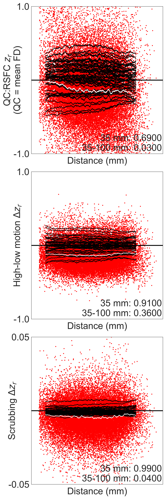

# ddmra

Code for running distance-dependent motion-related artifact analyses in Python

We've chosen to model our DDMRA approach off of the analyses performed in
[Power et al. (2018)](https://doi.org/10.1073/pnas.1720985115), with some changes.

## Example results

